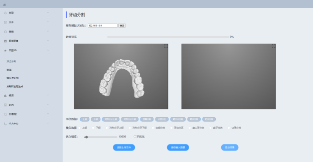

<div align="center">

# Flask 模板
<a href="https://cmake.org/"></a>
[]()
[]()

</div>


# 简介
提供良好的Flask推理框架，减少配置时间。

1. 前后端分离
2. 服务，视图，模型分离
3. 全局统一配置；




# 目录结构

```
├─.
│  app.py                            # 用于启动flask服务
│  README.md
│  test.py                           # 用于测试函数是否正常
│  
├─conf                               # 全局配置目录
│  │  config.py                      # 全局变量，主要用于函数调用
│  └─  __init__.py 
│  
│          
├─models                             # AI模型调用函数目录       
│  │  Split_deploy.py                # 分割部署示例
│  │  tools.py                       # 常用/复用函数
│  └─  __init__.py                   # 导入相关函数
│          
├─resources                          # 静态资源目录
│  └─cache                           # 上传/下载缓存文件 
│                                   
├─routes                             # 蓝图/路由目录
│  │  split.py                       # 分割蓝图示例
│  └─  __init__.py                   # 全局蓝图注册
│  
│          
├─services                           # 个性化服务定制
└─  __init__.py                      # 全局服务注册
│          
├─static                             # 前端静态资源
├─templates                          # 前端html模板
└─ui                                 # 前端界面渲染


```
# 使用指南
1. 首先配置 **config.py**  添加相应信息。
2. 在models下建立xxx_deploy.py，用于封装AI推理函数。
3. 在resources下放置AI模型文件。
4. 在routes定义调用路由。

可选：
*  services 定义不同调用的服务
*  static  templates  ui 放入相应前端文件


